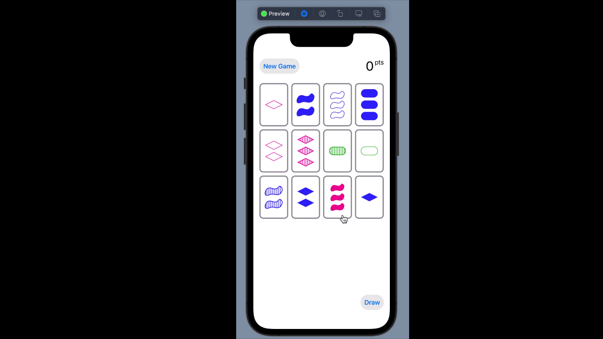
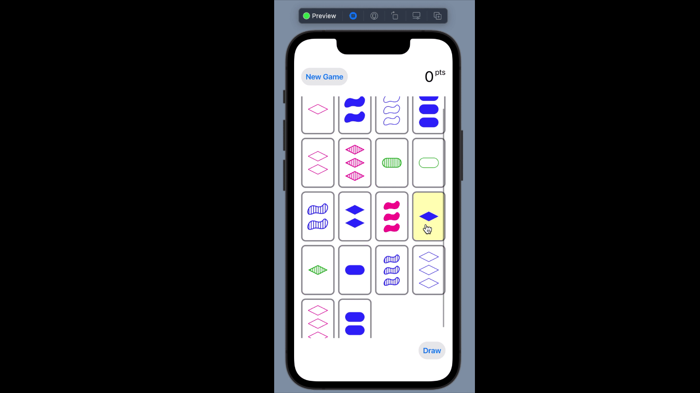

# Set Card Game (SwiftUI)

This project is part of learning ios development using swiftui
same with last project using UIKIT , built set card game 
rule on playing this game 
* (2 same + 1 diff) is no match
  example
    2 cards have red color and 1 blue is no match
* (3 diff ) or (3 same) is match

### Demo

